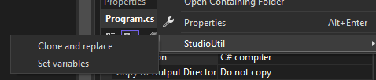
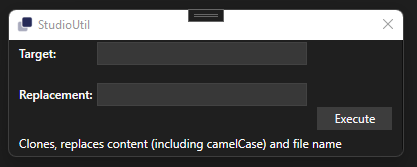

#  StudioUtil

A Visual Studio extension to ease development, with miscellaneous tools like fluent file cloning.

Download from the [Marketplace](https://marketplace.visualstudio.com/items?itemName=soenneker.StudioUtil), or from within `Visual Studio -> Extensions -> Manage Extensions`

## Features

### **Copy a file and replace the contents**

Simply right click in your Solution explorer the file you wish to 'clone and replace':

It will bring up a dialog:

Enter the `target` (what you wish to replace), and `replacement` (what you will replace `target` with).

After executing, it will create new file replacing the target's file name next to the original. It will replace all case sensitive instances as well as Camel case instances of the string within the document.

### **Set variables**

Save the `target` and `replacement` within the extension so you don't need to constantly enter those fields if doing heavy cloning.

## Notes

*This continues to be a work in progress; collaborators are welcome.*